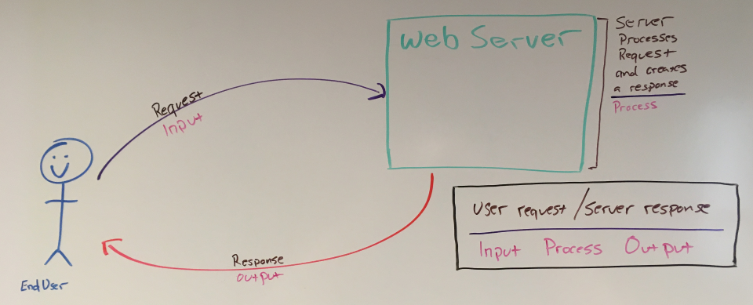
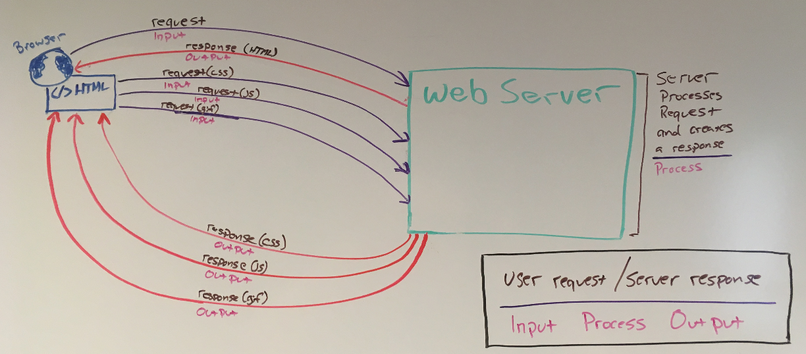

# User Request and Server Reponse

Every web page is created by a server responding to a user request. The user makes a request, the server process that request and creates a response. That reponse is most commonly in the form of an HTML document. In reality this response could be sent in any imaginable document format. This is an accurate but simplistic view of an IPO (input, process, output model). In practice, this process may be repeated multiple times in loading/interacticng with a single web page.

Let's replace the work user with client. In this description we will use *end user* to represent a human actor and *client* to represent software, in this case the browser. An end user opens a web browser (the client) and enters *www.youtube.com* into the address bar and presses [ENTER]. At this point the client (browser) makes a request with no paremters to the server at *www.youtube.com* the server sees their are no paramters, process the response and returns the YouTube homepage as an HTML document. This only returns and HTML document that describes how the page should be layout. There are no images, no videos, no styles, no colors, no javascript, no css, no special fonts, and so on1. These are all additional requests made by the client. The HTML document contains special references that when interpreted by the client (in this case a web browser) provides instructions for that client to make a request to a server (on behalf of the end user). Each of these additional requests are processed by a server which in turn creates a response and serves that reponse to the client. These responses are not typically HTML documents, rather these tend to by images, videos, stylesheets, javascript files, etc.

In summary a basic web page is served as follows

* A client makes a request to a server.
* That server processes the user request and returns an HTML document.
* The cleint processes that HTML document and makes additional requestsr as instructed by the document.
    * Each of these requests a processed a server.
    * Each of these servers creates a response and serves it to the client accrodingly.
    * The client processes each of these reponses and processes the instruction sets accordinly.
        * These may or may not lead to additional server requests.

## Summary
In this section you learned how a user request leads to a server response.

## Footnotes
<small>1. unless these are hardcoded into the page whitch may be done with descrition.</small>
